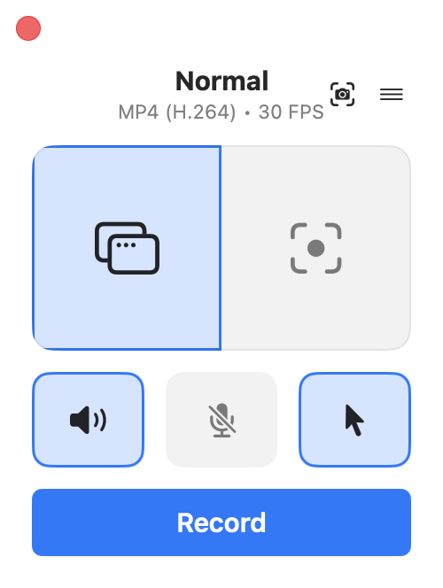
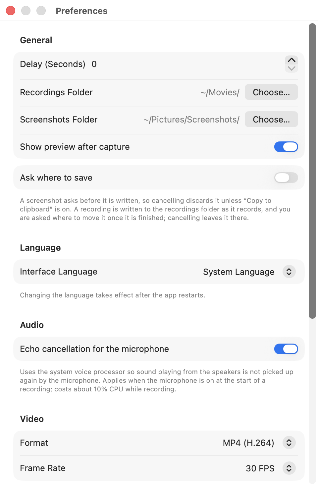

<div align="center">


# Glimpse

Registrare e catturare lo schermo su macOS, in modo semplice.

[](https://github.com/AlexDevFlow/Glimpse/actions/workflows/ci.yml)

[English](../README.md) · Italiano

</div>

Glimpse mette schermate e registrazione dello schermo dietro una sola icona nella
barra dei menu.

Le schermate usano una barra in cima allo schermo: rettangolo, finestra o schermo
intero, un timer di ritardo e un interruttore tra foto e video. La registrazione usa
una finestrella con la modalità di cattura, tre interruttori (audio di sistema,
microfono, puntatore) e un pulsante Registra.

Rispetto a ⌘⇧5 aggiunge gli interruttori di audio e puntatore attivi durante la
registrazione, la pausa con il tratto in pausa tagliato dal file, la scelta di
codec, contenitore, frequenza dei fotogrammi e livello di compressione, cartelle
separate per schermate e registrazioni, e dodici lingue di interfaccia.

È costruita su ScreenCaptureKit con un proprio `AVAssetWriter`. Nessuna dipendenza,
nessun binario incorporato, nessun accesso alla rete.

## Installazione

### Scarica

Prendi l'ultimo `Glimpse-macos.zip` dalla pagina
[Releases](https://github.com/AlexDevFlow/Glimpse/releases), estrailo e sposta
Glimpse.app nella cartella Applicazioni.

> [!IMPORTANT]
> Le release sono firmate ad-hoc e non autenticate, perché il progetto non ha un
> account Apple Developer a pagamento. macOS mette in quarantena tutto ciò che
> arriva dal web, quindi il primo avvio viene rifiutato. Aprila una volta, poi
> autorizzala da Impostazioni di Sistema → Privacy e sicurezza → Apri comunque.
> Quella strada lascia in piedi i controlli di Gatekeeper.
>
> Per togliere l'attributo direttamente:
>
> ```sh
> xattr -dr com.apple.quarantine /Applications/Glimpse.app
> ```
>
> Così salti del tutto il controllo di autenticazione, quindi fallo sapendo cosa
> comporta. Compilare dai sorgenti evita la questione.

### Compila dai sorgenti

Servono solo gli Xcode Command Line Tools.

```sh
make bundle        # build/Glimpse.app per questo Mac
make run           # ...e la apre
make install       # la copia in /Applications
make universal     # Apple silicon + Intel, come vengono fatte le release
make check         # controlla che le traduzioni siano coerenti
make test          # test unitari, richiedono Xcode completo
```

Tutto tranne `make test` funziona con i soli Command Line Tools. swift-testing non
gira senza Xcode; l'app in sé non ne ha mai bisogno.

## Schermate

<div align="center">



*La finestra del registratore: modalità di cattura, interruttori, Registra.*


*Modalità schermata: rettangolo, finestra o schermo intero, con timer di ritardo.*


*La stessa barra passata a video, con i tre interruttori di registrazione.*


*Durante la registrazione un HUD trascinabile resta in primo piano e viene tenuto
fuori dal video.*



*Preferenze: cartelle, lingua, audio, video, schermate, scorciatoie.*

</div>

## Cosa fa

Schermate: rettangolo, finestra o schermo intero, con timer di ritardo. Salvate in
PNG o JPEG, copiate negli appunti e mostrate in una piccola anteprima con Apri e
Mostra nel Finder.

Registrazione: MP4 o QuickTime, H.264 o HEVC, otto frequenze da 10 a 60 fps.

Qualità: Alta, Bilanciata o File leggeri. Una schermata è quasi tutta tinte piatte,
zone ferme e testo netto, quindi si comprime meglio di quanto assumano i valori
predefiniti di un encoder. Bilanciata, che è la predefinita, chiede metà del bitrate
di Alta: a 1080p su contenuto di schermata è costato circa 1 dB di PSNR per un terzo
in meno di peso. File leggeri lo dimezza ancora. A 4K/30 il tetto passa da 30 a 15 a
7 Mbit/s. Niente viene ricodificato dopo, quindi il file nasce già della dimensione
scelta. A parità di qualità l'HEVC produce file più piccoli dell'H.264.

Pausa e ripresa: il tratto in pausa viene tagliato dal file invece che congelato
dentro, così il timer e il video finito dicono la stessa cosa.

Interruttori dal vivo: audio di sistema, microfono e puntatore si cambiano a
registrazione in corso. L'audio disattivato viene scritto come silenzio, così il
file resta sincronizzato. Il microfono fa eccezione: deve essere acceso quando la
registrazione parte, e l'interruttore lo silenzia e lo riattiva. Se parti con il
microfono spento, per quella registrazione l'interruttore resta disattivato.

Cancellazione dell'eco: il microfono può passare dal processore vocale di macOS,
così l'audio degli altoparlanti non viene registrato due volte. Vale solo se il
microfono è acceso quando la registrazione parte.

Dove finiscono i file: cartelle separate per schermate e registrazioni, entrambe
raggiungibili dal menu, oppure un pannello di salvataggio per ogni cattura.

Scorciatoie: ⌃⇧S e ⌃⇧R di default, entrambe rimappabili.

Richiede macOS 15 o successivo. Apple silicon e Intel.

## Primo avvio

macOS mette davanti a un'app non firmata più ostacoli che a una dell'App Store. In
ordine, una volta ciascuno:

1. Estrai, sposta Glimpse.app in Applicazioni, aprila. macOS rifiuta.
2. Impostazioni di Sistema → Privacy e sicurezza, scorri in fondo, Apri comunque,
   autenticati, conferma. Quel pulsante compare solo per circa un'ora dopo
   l'avvio rifiutato.
3. Glimpse si apre come icona nella barra dei menu con una finestrella. Premi
   Registra.
4. macOS chiede il permesso di Registrazione schermo. Concedilo in Privacy e
   sicurezza → Registrazione schermo e audio di sistema, poi lascia che Glimpse si
   riavvii quando te lo propone.
5. Premi di nuovo Registra. Nella modalità predefinita Normale macOS mostra il
   proprio selettore per scegliere uno schermo o una finestra. Quel pannello è
   parte del sistema, non di Glimpse. Scegline uno e la registrazione parte.

Passa il riquadro di sinistra a Selezione se preferisci trascinare un'area invece
di usare il selettore di sistema.

Non c'è aggiornamento automatico. Tieni d'occhio la pagina Releases, o ricompila.

## Permessi

Al primo avvio macOS chiede Registrazione schermo (Impostazioni di Sistema → Privacy
e sicurezza → Registrazione schermo e audio di sistema). Il microfono viene chiesto
la prima volta che avvii una registrazione con il microfono acceso. macOS applica un
permesso appena concesso solo dopo aver riaperto l'app, e l'app si offre di
riavviarsi.

Con la firma ad-hoc, che è la predefinita, macOS considera l'app nuova a ogni
ricompilazione e richiede di nuovo il permesso. Se compili spesso, crea una volta un
certificato locale:

```sh
sh scripts/make-signing-cert.sh
make bundle SIGN_IDENTITY="Glimpse Dev"
```

Se una compilazione successiva fallisce con `errSecInternalComponent`, alla chiave
manca la partition list. Riesegui lo script: riautorizza un'identità che esiste già.

## Uso

| Azione | Scorciatoia predefinita |
|---|---|
| Schermata (overlay) | ⌃⇧S |
| Avvia / ferma registrazione | ⌃⇧R |
| Annulla l'overlay | Esc |
| Conferma la selezione | Invio |

Le scorciatoie si cambiano dalle Preferenze. Una scorciatoia richiede ⌘, ⌃ o ⌥. Un
tasto da solo, o con il solo ⇧, viene rifiutato, perché macOS gli lascerebbe
intercettare quel tasto in ogni applicazione del Mac; un tasto funzione da solo è
ammesso. Per rimpiazzare ⌘⇧3 / ⌘⇧4 / ⌘⇧5 disattiva prima quelle di sistema in
Impostazioni di Sistema → Tastiera → Abbreviazioni da tastiera → Istantanee.

Nell'overlay delle schermate trascini un'area e premi Invio o Cattura; oppure passi
sopra una finestra e fai clic; oppure fai clic sullo schermo che vuoi. L'icona video
nella barra riusa la stessa selezione per avviare una registrazione e mostra gli
interruttori di audio di sistema, microfono e puntatore.

Il timer in quella barra vale per quella cattura. Se non lo tocchi, una registrazione
avviata dall'overlay usa il Ritardo delle Preferenze. I due non si sommano mai.

Durante la registrazione la finestra principale sparisce e resta un HUD flottante:
trascinabile, escluso dal video, con timer, i tre interruttori, Pausa e Stop. Gli
stessi interruttori sono nel menu della barra dei menu, insieme a Pausa e Riprendi e
alle due voci per le cartelle.

La pausa tiene su lo stream ma non scrive nulla, e il file finito salta la pausa. Una
registrazione in pausa per un minuto è un minuto più corta, non un minuto di fermo
immagine.

Attivando Chiedi dove salvare, nelle Preferenze, ogni cattura passa da un pannello di
salvataggio. Una schermata lo chiede prima di essere scritta, quindi annullare la
scarta a meno che sia attivo anche Copia negli appunti. Una registrazione deve essere
scritta da qualche parte mentre registra, quindi va nella cartella delle registrazioni
e il pannello chiede dove spostarla dopo; annullare lì la lascia dov'è.

Se una registrazione viene interrotta da qualcosa fuori dall'app, come la finestra
registrata che si chiude, uno schermo scollegato o il disco pieno, Glimpse chiude
quello che ha e ti consegna il file parziale.

## Lingue

English, Italiano, Español, Deutsch, Français, Português, Русский, Українська, 日本語, 한국어, 简体中文 e 繁體中文.
L'interfaccia segue l'ordine delle lingue di macOS; Preferenze → Lingua la fissa a
una sola lingua indipendentemente dall'impostazione di sistema.

Aggiungerne una è quasi solo copiare `en.lproj` e tradurre i valori. `make check`
verifica poi che non si sia persa nessuna chiave né segnaposto. I passaggi sono in
[CONTRIBUTING.md](../CONTRIBUTING.md).

## Contribuire

Segnalazioni, traduzioni e patch sono benvenute. Vedi
[CONTRIBUTING.md](../CONTRIBUTING.md). Le versioni rilasciate sono in
[CHANGELOG.md](../CHANGELOG.md). Tutto ciò che riguarda dati di schermo o microfono
dovrebbe passare da [SECURITY.md](../SECURITY.md) invece che da una issue pubblica.

## Struttura del progetto

```
Sources/Glimpse/
  App/         punto d'ingresso SwiftUI, barra dei menu, hotkey, app delegate
  Model/       impostazioni persistenti, profili video, elenco lingue
  Recording/   SCStream + AVAssetWriter, picker di sistema, macchina a stati, HUD
  Capture/     overlay a schermo intero (rettangolo / finestra / schermo) e barra
  Screenshot/  flusso schermate, salvataggio, pannello di anteprima
  UI/          finestra principale, preferenze, registratore di scorciatoie
  Util/        hotkey Carbon, KeyCombo, coordinate, permessi, log, L()
Tests/         test unitari per la logica pura
Resources/     Info.plist, icona generata, una .lproj per lingua
scripts/       generatore icona, certificato locale, controllo traduzioni
docs/          traduzioni del README e schermate
```

## Limiti noti

Vale la pena conoscerli prima di affidarti all'app.

L'audio di sistema e il microfono sono due tracce separate. macOS le riproduce
entrambe, quindi in locale la registrazione suona giusta, ma la maggior parte del
software che legge il file ne sceglie una sola e tiene quella di sistema, quindi il
commento parlato sparisce. Non è solo questione di ricodifica: `ffmpeg -c copy`, un
puro rimescolamento senza alcuna codifica, la perde, e la perde anche
`AVAssetExportSession` su ogni preset di transcodifica, cioè il motore dietro
«Esporta come» di QuickTime Player e parecchio software di montaggio e caricamento
per Mac. Solo il preset Passthrough le tiene entrambe. Finché non ci sarà l'opzione a
traccia unica, esporta con qualcosa che conservi tutte le tracce audio, o registra il
parlato a parte.

Sopra i 4096 pixel di larghezza l'uscita H.264 finisce a Level 6.0, più recente della
maggior parte dei decoder hardware. Uno schermo 5K, o un pannello 4K in modalità
HiDPI scalata, può produrre un file che alcuni browser, telefoni ed editor rifiutano.

Schermate e registrazioni non condividono lo spazio colore. Una schermata mantiene il
profilo del display, Display P3 sulla maggior parte dei Mac attuali; una registrazione
è marcata Rec. 709, perché forzare il video a corrispondere lo scurisce. I colori
saturi possono apparire leggermente diversi fra uno scatto e un video della stessa
schermata.

Un microfono lento può restare fuori dalla registrazione. Il writer viene costruito
con i formati visti nel primo secondo e mezzo, e un auricolare Bluetooth che cambia
profilo può metterci di più, lasciando la registrazione senza traccia microfono. Lo
dice solo il log. Avvia la registrazione a cuffie già attive.

La latenza del microfono non è compensata. Un auricolare Bluetooth può arrivare da 100
a 200 ms dopo l'immagine.

Ridimensionare la finestra registrata a metà registrazione produce bande nere per il
resto della ripresa. Le dimensioni dell'uscita sono fissate all'avvio.

Una pausa può spostare l'audio rispetto al video di al massimo un pacchetto audio,
circa 21 ms, quindi molte pause in una registrazione accumulano una piccola deriva.

## Crediti

La finestra di registrazione è modellata su
[Kooha](https://github.com/seadve/kooha) di Dave Patrick Caberto (GPL-3.0), un
registratore per GNOME. Questa è un'implementazione macOS indipendente: non usa
codice né grafica di Kooha, e l'icona dell'app e l'overlay di cattura sono originali.
Le chiavi delle impostazioni ricalcano di proposito lo schema di Kooha. Le icone
dentro l'app sono SF Symbols di Apple.

Differenze da tenere presenti: niente WebM o GIF, perché su macOS i contenitori
nativi sono MP4/MOV con H.264/HEVC; la scelta di monitor e finestra passa dal picker
di sistema di macOS, come Kooha usa il portale xdg su Linux; e le schermate sono metà
dell'app, non uno strumento a parte.

## Licenza

[MIT](../LICENSE) © 2026 AlexDevFlow
